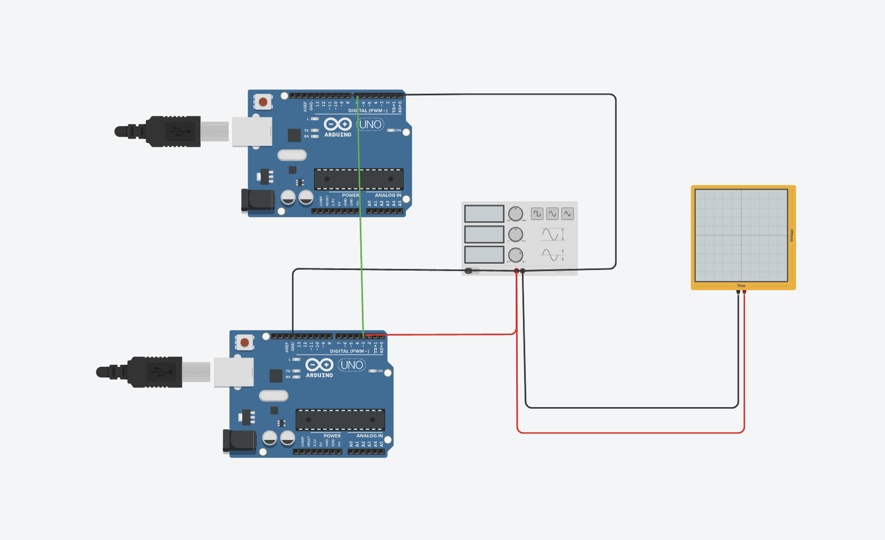
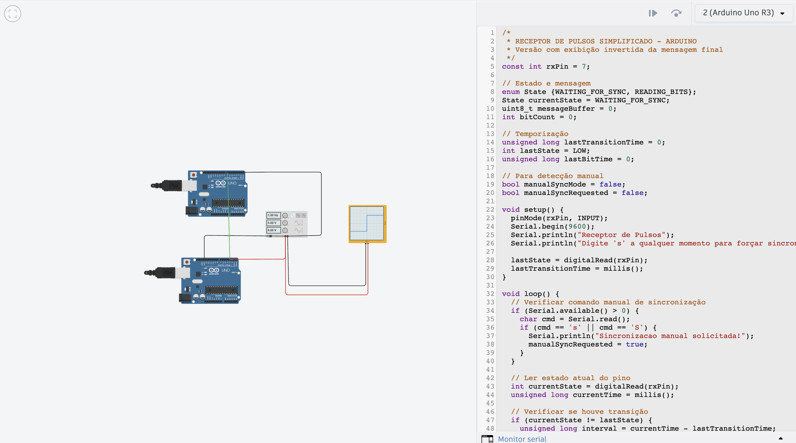

# 🔌 Simulador de Dispositivo IoT com Arduino e Protocolo de Pulso

Esse repositório contém a implementação de um simulador simplificado de dispositivos IoT utilizando Arduino, com comunicação baseada em pulsos.

## 📌 Objetivo

Criar um simulador de dispositivos IoT que envia mensagens simuladas, seguindo o comportamento de sensores reais, com estrutura de comunicação compatível com protocolos de IoT (como o MQTT, de forma conceitual).

## 📸 Imagens do Projeto

### Montagem no Tinkercad


### Código no Arduino + Osciloscópio Virtual


> As imagens mostram a simulação de dois Arduinos trocando dados binários, com sinal sendo visualizado no osciloscópio para validação dos pulsos.

## 🧠 Lógica de Funcionamento

- O receptor aguarda uma transição de pulso para sincronização.
- Cada transição entre `HIGH` e `LOW` representa um bit.
- A cada 5 bits (4 dados + 1 checksum), o receptor verifica a validade da mensagem.
- A mensagem válida é invertida (bitwise) antes de ser exibida.
- Um modo manual permite forçar a sincronização pressionando `'s'` no monitor serial.

## 🧪 Evidência de Funcionamento

📹 **Demonstração em Vídeo**: [Link do vídeo demonstrativo](https://youtu.be/seu-link-aqui)

No vídeo, é possível observar:

- A transmissão dos bits através dos pulsos elétricos.
- A leitura da mensagem via monitor serial.
- A lógica de checksum funcionando corretamente.
- A sincronização manual via entrada serial.

## ⚙️ Como Rodar o Projeto

### 🛠 Requisitos

- Arduino IDE instalado
- 2 placas Arduino Uno (ou simulação no Tinkercad)
- Cabos jumper ou ambiente virtual

### 📦 Instalação e Execução

1. Clone este repositório:

```bash
git clone https://github.com/seu-usuario/simulador-iot-arduino.git
cd simulador-iot-arduino
